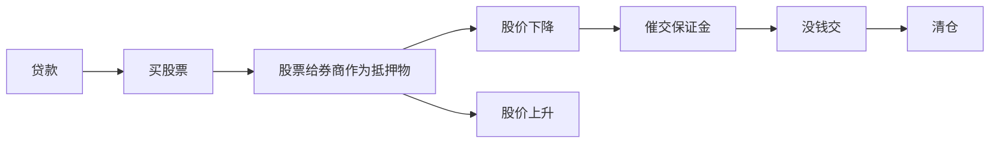
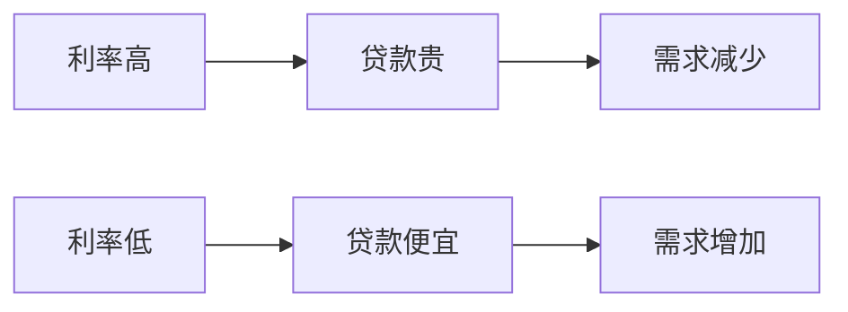
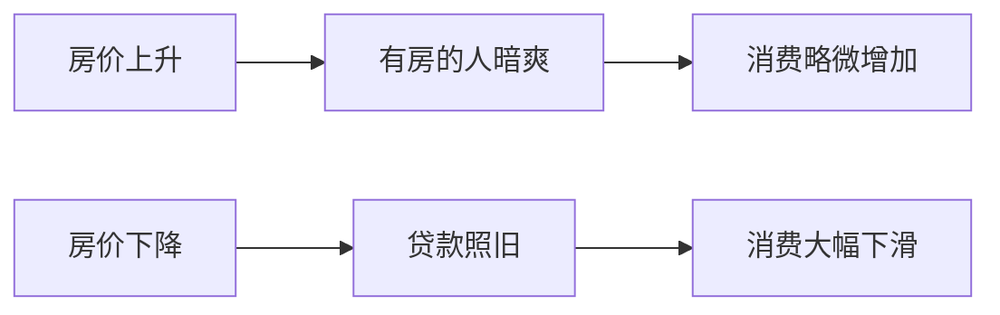

## 房地产特点

在整个经济中非常特殊，非常重要。

### 任何人都有着这个需要（**刚需**）。

### 房子会增值（**投资品**）。

并不等于效用，而是等于预期价值。

越涨越买，越买越涨。

中国家庭资产中约70%都是房地产。

美国28.9%。

人越富有，资产中房地产占比越低。

### 房子和信用绑定

房地产抵押。

因为买房而背负债务几十年。

## 贷款

### 链式反应

#### 金融产品抵押

:::note
鉴于股票、证券的流动性，这种方式银行和券商基本上没有风险。
:::

#### 房屋抵押

:::note
房屋流动性本身比较小，即使拍卖，也不一定能拍到市场价格。所以银行会承担较大风险。
:::

:::note
流动性抽干有点类似于央行加息的效果。
:::

## 影响因素

### 人口

一般情况下，一个国家的人口相对是闭环的。

年轻人越多，房地产后劲也就越足。

相对的年轻人越少，房地产承受越大的压力。

老龄化严重的国家，房地产萎靡。

### 经济

一般来讲，国家或者城市越有钱，房价也就越高。

外部投资，也会导致房价迅速增长。（比如买房度假、炒房客）。

### 利率

### 政策

购房优惠、购房限制、税收

### 供给

供求关系

### 当地实际情况

气候、环境

## 投资品的价格波动和实体经济

### 股票

### 房地产

## 土地财政

土地财政源于1987年开始的土地有偿出让。

上世纪80年代，少数城市开始尝试土地有偿出让和住房商品化改革，1990和1992年国务院分别发布了土地出让的暂行条例和暂行管理办法，1993—1994年开始推行住房商品化改革，土地和住房才开始成为商品。

按照早期的设计，住房改革实行双轨并行的体制，为中低收入居民提供保障性住房，为高收入居民提供商品住房。但在实行过程中，地方政府的利益导向使商品房比重越来越大，保障性住房受到挤压。2000年以后，商品房用地的收入越来越成为地方政府重要的收入来源，从此开始了土地财政时期。

:::note
如此这般循环，虽然经济是上去了，但是房价便是蹭蹭蹭上涨。
:::