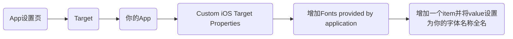

## 准备工作



```mermaid
flowchart LR
    A(App设置页)-->B(Target)-->C(你的App)-->D(Custom iOS Target Properties)-->E(增加Fonts provided by application)-->F(增加一个item并将value设置为你的字体名称全名)
```

## 使用

```swift
Text("登陆即代表同意")
    .font(.custom("LXGWWenKaiGBScreen", size: 14))
```
