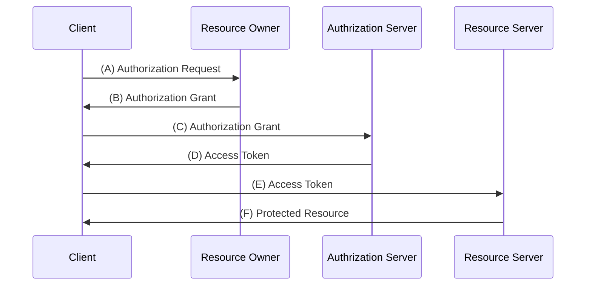
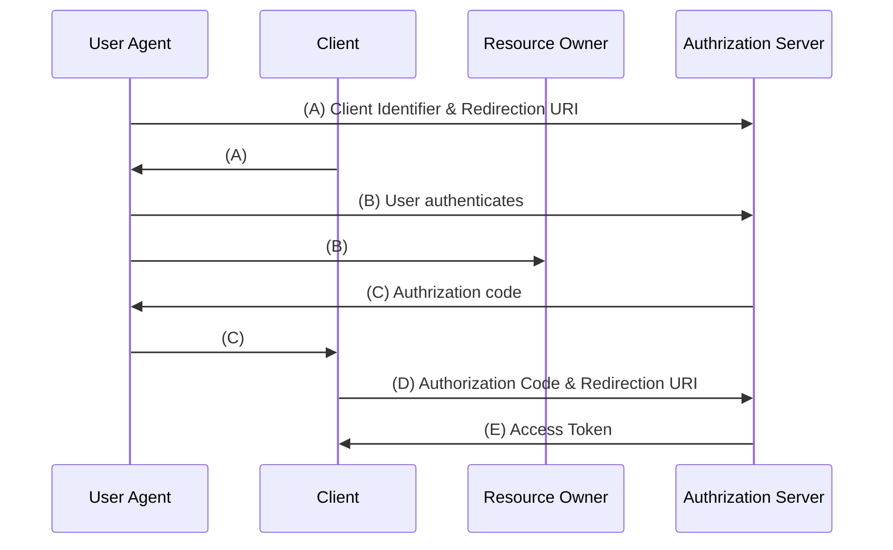
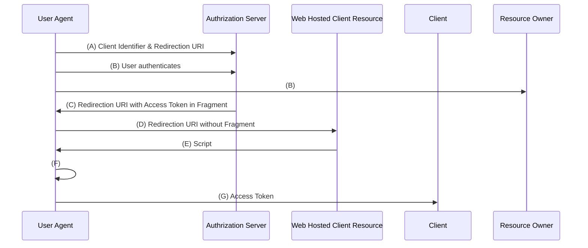
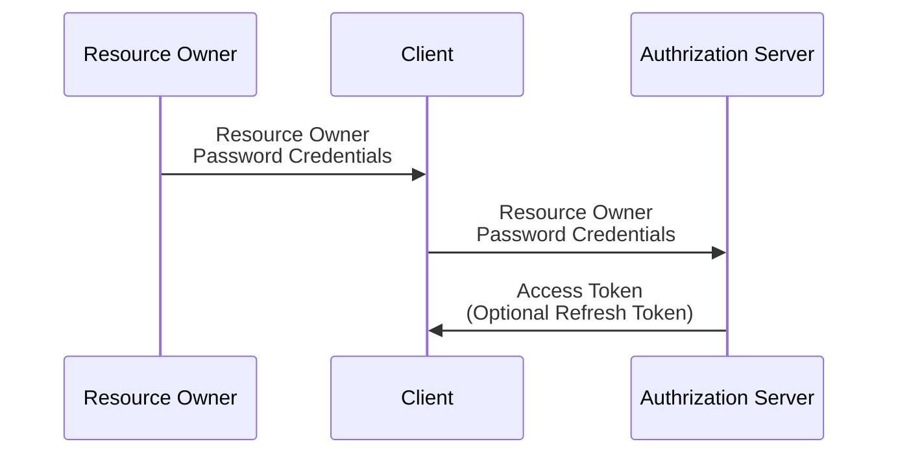
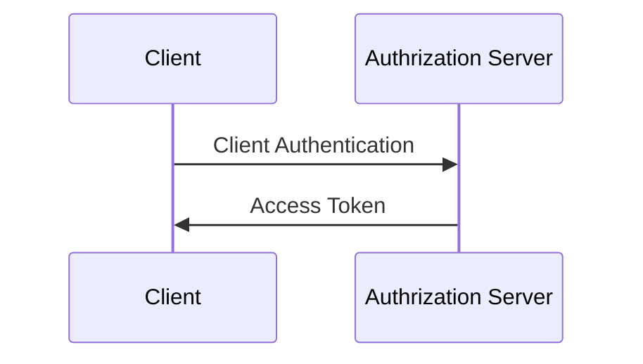

> 基于[理解OAuth 2.0](https://www.ruanyifeng.com/blog/2014/05/oauth_2_0.html)的一些修改

## OAuth中存在几个对象

- Third-party application：第三方应用程序，本文中又称"客户端"（client）。
- HTTP service：HTTP服务提供商，本文中简称"服务提供商"。
- Resource Owner：资源所有者，本文中又称"用户"（user）。
- User Agent：用户代理，本文中就是指浏览器。
- Authorization server：认证服务器，即服务提供商专门用来处理认证的服务器。
- Resource server：资源服务器，即服务提供商存放用户生成的资源的服务器。它与认证服务器，可以是同一台服务器，也可以是不同的服务器。

## 运行流程

:::note
- A 用户打开客户端后，客户端要求给用户授权
- B 用户同意给客户端授权
- C 客户端使用上一步获取到的授权，向认证服务器申请令牌
- D 认证服务器对客户端进行认证之后，确认无误，统一发放令牌
- E 客户端使用令牌，向资源服务器申请获取资源
- F 资源服务器确认令牌无误，同意向客户端开放资源
:::

## 客户端的授权模式

- 授权码模式（authorization code）
- 简化模式（implicit）
- 密码模式（resource owner password credentials）
- 客户端模式（client credentials）

### 授权码模式

:::note
- A 用户访问客户端，后者将前者导向认证服务器。
- B 用户选择是否给予客户端授权。
- C 假设用户给予授权，认证服务器将用户导向客户端事先指定的"重定向URI"（redirection URI），同时附上一个授权码。
- D 客户端收到授权码，附上早先的"重定向URI"，向认证服务器申请令牌。这一步是在客户端的后台的服务器上完成的，对用户不可见。
- E 认证服务器核对了授权码和重定向URI，确认无误后，向客户端发送访问令牌（access token）和更新令牌（refresh token）。
:::

### 简化模式

:::note
- A 客户端将用户导向认证服务器。
- B 用户决定是否给于客户端授权。
- C 假设用户给予授权，认证服务器将用户导向客户端指定的"重定向URI"，并在URI的Hash部分包含了访问令牌。
- D 浏览器向资源服务器发出请求，其中不包括上一步收到的Hash值。
- E 资源服务器返回一个网页，其中包含的代码可以获取Hash值中的令牌。
- F 浏览器执行上一步获得的脚本，提取出令牌。
- G 浏览器将令牌发给客户端。
:::

### 密码模式

:::note
- A 用户向客户端提供用户名和密码。
- B 客户端将用户名和密码发给认证服务器，向后者请求令牌。
- C 认证服务器确认无误后，向客户端提供访问令牌。
:::

### 客户端模式

:::note
- A 客户端向认证服务器进行身份认证，并要求一个访问令牌。
- B 认证服务器确认无误后，向客户端提供访问令牌。
:::